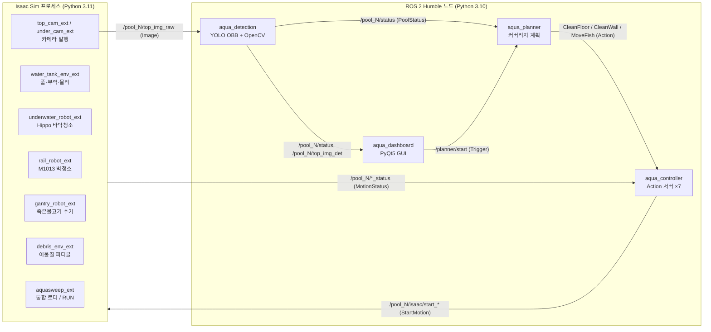
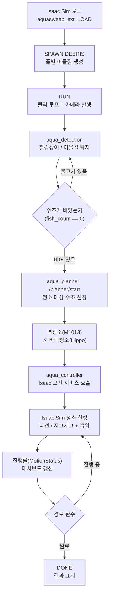

# 🐟 AquaSweep — 양식장 청소 로봇 시뮬레이터

> 사람이 들어가기 어려운 양식장 수조, 로봇이 대신 청소하면 어떨까요?

AquaSweep는 **철갑상어 양식장을 통째로 가상으로 옮겨놓고**, 그 안에서 로봇들이
스스로 바닥·벽을 청소하고 죽은 물고기까지 수거하도록 만든 시뮬레이션이에요.

- 🧽 **Hippo** — 수조 바닥을 누비며 이물질을 빨아들이는 청소 로봇
- 🦾 **벽 청소 코봇** — 수조 둘레 레일을 돌며 벽을 닦는 협동로봇
- 🪝 **갠트리** — 천장에서 내려와 죽은 물고기를 건져 올리는 크레인
- 👁️ **AI 인지** — 카메라로 물고기와 오염을 알아보고, 청소 타이밍을 판단

NVIDIA Isaac Sim으로 물·물리·카메라를 시뮬레이션하고, ROS 2로 **수조 7개의 로봇들을
동시에** 제어합니다.

---

## 📑 목차

1. [⚡ 빠른 시작](#-빠른-시작)
2. [✨ 주요 기능](#-주요-기능)
3. [🏗️ 시스템 설계 & 동작 흐름](#️-시스템-설계--동작-흐름)
4. [💻 어디서 돌아가나요? (실행 환경)](#-어디서-돌아가나요-실행-환경)
5. [🤖 사용한 장비](#-사용한-장비)
6. [📦 의존성](#-의존성)
7. [🚀 실행 순서](#-실행-순서)
8. [🗂️ 디렉터리 구조](#️-디렉터리-구조)

---

## ⚡ 빠른 시작

일단 한번 돌려보고 싶다면, 이 세 줄이면 됩니다.

```bash
git clone https://github.com/yevettee/AquaSweep.git ~/AquaSweep
cd ~/AquaSweep/water_ws && colcon build && source install/setup.bash
ros2 launch aqua_hippo aqua_hippo.launch.py   # Isaac Sim을 켠 뒤 실행
```

> 💡 처음이라면 Isaac Sim 설치와 커스텀 메시지 빌드 같은 준비 단계가 필요해요.
> 막히는 부분 없이 따라 하려면 [🚀 실행 순서](#-실행-순서)부터 보는 걸 추천합니다.

---

## ✨ 주요 기능

## 주요 기능

- **양식장 환경 재현** — 40 m × 30 m 건물 안에 직경 8 m 원통형 수조 7개를 배치하고, 수조마다
  철갑상어(5~7마리)와 바닥 이물질 파티클을 생성합니다.
  (`water_tank_env_ext`, `debris_env_ext`)

- **바닥 청소 로봇 "Hippo"** — BCD(부력 제어, 가라앉았다 떠오르는 부력 조절 방식)로 수중에서
  동작합니다. 아르키메데스 나선 경로를 자체 생성(내부 Pure-Pursuit)하거나 외부 `cmd_vel`을 받아
  주행하면서 이물질을 흡입합니다. 수조당 1대, 총 7대가 동시에 동작합니다.
  (`underwater_robot_ext`)

- **벽면 청소 협동로봇** — Doosan M1013 6축 코봇을 수조 외벽 원형 레일에 장착해, 레일과 팔을
  동시에 움직이는 지그재그 패턴으로 벽면을 청소합니다.
  (`rail_robot_ext`)

- **천장 갠트리 로봇** — X-Y-Z 갠트리가 죽은(또는 의심) 개체를 흡착하여 수거함으로 이송합니다.
  (`gantry_robot_ext`)

- **비전 기반 인지** — Top-view 카메라 영상에서 YOLO OBB로 철갑상어를, OpenCV로 바닥 이물질을
  검출합니다. 개체의 활동성(움직임) 지표로 정상/의심 개체를 분류하고, 결과는 다중 프레임으로
  안정화합니다.
  (`aqua_detection`)

- **다중 수조 작업 계획·제어** — 청소 가능 조건(`fish_count == 0`)을 만족하는 수조를 선별해
  벽청소와 바닥청소를 병렬로 지시합니다. Planner(계획) → Controller(실행) → Isaac Sim(시뮬)
  순으로 명령이 전달됩니다.
  (`aqua_planner`, `aqua_controller`)

- **대시보드 GUI** — PyQt5 기반 GUI에서 수조별 상태, 카메라 영상, 청소 진행률을 표시하고
  Start/Pause를 제어합니다.
  (`aqua_dashboard`)

---
## 🏗️ 시스템 설계 & 동작 흐름

### 전체 구성

Isaac Sim 프로세스(Python 3.11)와 ROS 2 노드(Python 3.10)가 토픽·서비스·액션으로 통신합니다.



### 청소 동작 흐름



### 구성 요소

**Isaac Sim 익스텐션** (`isaac_sim_extensions/`) — 시뮬레이션 환경을 구성합니다.

| 익스텐션 | 역할 |
|---|---|
| `aquasweep_ext` | 전체를 일괄 로드하는 통합 로더. LOAD → SPAWN DEBRIS → RUN → PUBLISH CAMS 워크플로우 |
| `water_tank_env_ext` | 건물·수조 7개 USD 씬 구성, 부력/항력 물리, 철갑상어 스폰·애니메이션 |
| `underwater_robot_ext` | Hippo 바닥청소 로봇, 부력 상태머신, 나선 경로, 흡입 시스템 |
| `rail_robot_ext` | M1013 벽청소 코봇, 원형 레일, 지그재그/클래식 플래너 |
| `gantry_robot_ext` | 천장 갠트리, 죽은 물고기 수거 상태머신 |
| `debris_env_ext` | 수조별 이물질 파티클 생성 |
| `top_cam_ext` / `under_cam_ext` | OmniGraph 기반 카메라 영상 ROS 2 발행 |
| `common/` | 공유 유틸 (Isaac rclpy 환경 설정, 명령 브리지) |

**ROS 2 패키지** (`water_ws/src/`) — 로봇 인지·계획·제어를 담당합니다.

| 패키지 | 노드 / 진입점 | 역할 |
|---|---|---|
| `aqua_interfaces` | (메시지/서비스/액션 정의) | 통신 규격의 단일 출처 |
| `aqua_controller` | `controller_node` ×7 | 수조별 Action 서버, Isaac 모션 서비스 중계, 로봇 상태 발행 |
| `aqua_planner` | `planner_node` | 수조 상태 모니터링, 청소 대상 선정, 벽·바닥 청소 오케스트레이션 |
| `aqua_detection` | `fish_detection_node` | YOLO OBB 물고기 탐지 + OpenCV 이물질, 수조 상태 발행 |
| `aqua_dashboard` | `dashboard_node`, `dashboard_gui` | 상태 모니터링 / PyQt5 GUI |
| `aqua_hippo` | (launch 전용) | 전체 bringup 런치 |


**ROS 2 패키지** (`water_ws/src/`) — 로봇을 인지·계획·제어하는 쪽이에요.

| 패키지 | 노드 / 진입점 | 하는 일 |
|---|---|---|
| `aqua_interfaces` | (메시지/서비스/액션 정의) | 모든 통신 규격의 단일 출처 |
| `aqua_controller` | `controller_node` ×7 | 수조별 Action 서버, Isaac 모션 서비스 중계, 로봇 상태 발행 |
| `aqua_planner` | `planner_node` | 수조 상태를 보고 청소할 곳 선정, 벽·바닥 청소 지휘 |
| `aqua_detection` | `fish_detection_node` | YOLO OBB 물고기 탐지 + OpenCV 이물질, 수조 상태 발행 |
| `aqua_dashboard` | `dashboard_node`, `dashboard_gui` | 상태 모니터링 / PyQt5 GUI |
| `aqua_hippo` | (launch 전용) | 전체를 한 번에 켜는 bringup 런치 |

**ROS 2 통신 규격** (`aqua_interfaces`)

- 메시지: `PoolStatus`, `RobotStatus`, `MotionStatus`, `MotionParams`, `PoolPhysicalVariables`
- 서비스: `StartMotion`, `StopMotion`, `PauseMotion`, `ResumeMotion`
- 액션: `CleanFloor`, `CleanWall`, `MoveFish`

---

## 💻 실행 환경

| 항목 | 버전 |
|---|---|
| OS | Ubuntu 22.04 LTS |
| ROS 2 | Humble Hawksbill |
| 시뮬레이터 | NVIDIA Isaac Sim 5.1 (5.1.0-rc.19) |
| Python (ROS 2 노드) | 3.10 (시스템 / `/opt/ros/humble`) |
| Python (Isaac Sim 내장) | 3.11 |
| GPU | NVIDIA RTX (CUDA) — 렌더링·PhysX GPU 파티클·YOLO 추론에 필요 |

> ⚠️ ROS 2 노드는 시스템 Python 3.10, Isaac Sim 익스텐션은 Isaac 내장 Python 3.11에서
> 동작합니다. 두 런타임이 동일한 커스텀 메시지(`aqua_interfaces`)를 사용하려면 빌드를 두 번
> 수행해야 합니다([실행 순서](#실행-순서) 참고).

---

## 🤖 사용한 장비

### 시뮬레이션 속 로봇 3종

| 장비 | 모델 / 에셋 | 사양 · 역할 |
|---|---|---|
| 바닥 청소 로봇 | Hippo (`underwater_robot_ext/data/hippo_v1_lite.usdz`) | 수중 주행 휠 로봇, ~15 kg, 풋프린트 ~0.69 m, BCD 부력 제어, 수조당 1대(총 7대) |
| 벽면 청소 코봇 | Doosan M1013 (`assets/robot/m1013.usd`) | 6축 협동로봇, 리치 1.3 m, 페이로드 10 kg, 원형 레일(반경 4.07 m, 높이 1.53 m) 장착 |
| 갠트리 로봇 | 절차적 생성 (USD 빌더) | 천장(높이 7 m) X-Y-Z 갠트리, 흡착 패드로 죽은 물고기 수거 |

### 센서 (카메라)

| 센서 | 토픽 | 해상도 |
|---|---|---|
| 온보드(수중) 카메라 | `/pool_N/under_img_raw` | 1280×720 |
| 수조별 Top-view 카메라 | `/pool_N/top_img_raw` | 640×480 |
| 전역 Top 카메라 | `/global/top_img_raw` | 2560×1920 (7개 수조 단일 렌더) |

### 환경 에셋 (`assets/`)

- `scenes/aquafarm_environment.usda`, `aquafarm_final.usdz` — 양식장 건물(40×30 m)
- `scenes/pool_shell.usda` — 원통형 수조 외피(물리 충돌 포함)
- `scenes/fish_bin.usdz` — 죽은 물고기 수거함
- `shark/sturgeon_final.usdc` — 철갑상어 메시
- `car/*.usdz` — 야외 주차장 데코 차량 4종

### 권장 하드웨어

- NVIDIA RTX GPU (VRAM 8 GB 이상 권장) + 최신 드라이버 / CUDA
- Isaac Sim 권장 사양을 만족하는 데스크톱 (RAM 32 GB 이상 권장)

---

## 📦 의존성

의존성은 설치 방식에 따라 세 가지로 구분됩니다.

### 1) 별도 설치 (apt / 공식 설치 프로그램)

- **ROS 2 Humble** — `rclpy`, `std_msgs`, `std_srvs`, `geometry_msgs`, `sensor_msgs`,
  `nav_msgs`, `cv_bridge`(`ros-humble-cv-bridge`). 각 패키지의 `package.xml`에 명시되어
  `rosdep`으로 설치할 수 있습니다.
- **NVIDIA Isaac Sim 5.1** — 공식 설치 프로그램으로 설치하며, 내장 Python 3.11과 rclpy
  브리지가 함께 포함됩니다.

### 2) pip 설치 ([`requirements.txt`](requirements.txt))

```
numpy>=1.24
opencv-python>=4.8
ultralytics>=8.1      # YOLO OBB 추론 (torch / torchvision 포함)
PyQt5>=5.15           # 대시보드 GUI
```

```bash
pip install -r requirements.txt
```

> 💡 `cv_bridge`, `rclpy`, 메시지 패키지는 pip가 아니라 ROS 2 설치본에서 제공됩니다.
> YOLO 가중치 `water_ws/src/aqua_detection/models/yolo_obb_new.pt`는 저장소에 포함되어 있습니다.

### 3) 저장소 내부 빌드

- `aqua_interfaces` — 프로젝트 커스텀 메시지/서비스/액션 패키지입니다. ROS 2(3.10)와
  Isaac Sim(3.11) 양쪽에서 사용하므로 두 번 빌드합니다([실행 순서](#실행-순서) 참고).

---

## 🚀 실행 순서

> 아래 예시는 저장소를 `~/AquaSweep`에 클론했다고 가정합니다. 클론 위치·디렉터리명은 자유이며,
> 경로만 맞추면 됩니다(`AquaSweep/` = 이 README가 있는 저장소 루트).

### 1단계 · ROS 2 워크스페이스 빌드 (Python 3.10)

```bash
git clone https://github.com/yevettee/AquaSweep.git ~/AquaSweep
cd ~/AquaSweep/water_ws
colcon build
source install/setup.bash
```

### 2단계 · Isaac Sim용 `aqua_interfaces` 빌드 (Python 3.11)

Isaac Sim 내장 rclpy가 커스텀 메시지를 인식하도록 한 번 실행합니다. 메시지/액션/서비스 정의를
변경할 때마다 다시 실행합니다.

```bash
cd ~/AquaSweep          # 저장소 루트
./water_ws/scripts/install_aqua_interfaces_for_isaac.sh
# 경로가 다르면 ISAAC_PYTHON, ISAAC_ROS2_BRIDGE 환경변수로 지정
```

### 3단계 · Isaac Sim 실행 및 씬 구동

1. Isaac Sim을 실행하고 `aquasweep_ext` 익스텐션을 활성화합니다.
   (Window ▸ Extensions에서 `~/AquaSweep/isaac_sim_extensions/` 폴더를 ext 검색 경로로 추가)
2. AquaSweep 패널의 버튼을 위에서부터 순서대로 클릭합니다.
   - **LOAD** — 건물·수조·물고기를 씬에 배치
   - **SPAWN DEBRIS** — 바닥에 청소 대상 이물질 생성
   - **RUN** — 물리 시뮬레이션 시작 (로봇 동작 개시)
   - **PUBLISH CAMS** — 카메라 영상 ROS 2 발행 시작

### 4단계 · ROS 2 노드 bringup

별도 터미널에서 제어·인지·대시보드 노드를 일괄 실행합니다.

```bash
source /opt/ros/humble/setup.bash
source ~/AquaSweep/water_ws/install/setup.bash
ros2 launch aqua_hippo aqua_hippo.launch.py
```

실행되는 노드:

- `all_robots.launch.py` — `controller_node` ×7 (`pool_1`~`pool_7`)
- `fish_detection_node` (`aqua_detection`)
- `planner_node` (`aqua_planner`)
- `dashboard_gui` (`aqua_dashboard`)

### 5단계 · 청소 시작

대시보드에서 Start를 누르거나 서비스로 직접 호출합니다.

```bash
# 청소 가능한 모든 수조 시작
ros2 service call /planner/start std_srvs/srv/Trigger "{}"

# 특정 수조만 바닥 청소
ros2 service call /pool_1/start_clean_floor std_srvs/srv/Trigger "{}"
```

### 디버깅

```bash
ros2 topic echo /pool_1/status              # 수조 상태(PoolStatus)
ros2 topic echo /under_robot_1/cmd_vel      # 로봇 속도 명령
ros2 action list                            # /pool_N/clean_floor 등 확인
ros2 node list                              # 노드 동작 확인
```

> 📚 단일 수조·노드 단위 통합 테스트 절차는 [`docs/integration_test_guide.md`](docs/integration_test_guide.md),
> 서비스 통신 규약은 [`docs/controller_isaac_architecture.md`](docs/controller_isaac_architecture.md)에
> 정리되어 있습니다.

---

## 🗂️ 디렉터리 구조

```
AquaSweep/                            # Git 저장소 루트 (git clone 시 생성)
├── isaac_sim_extensions/             # Isaac Sim 익스텐션 (Python 3.11)
│   ├── aquasweep_ext/                #   통합 로더 (LOAD/RUN 워크플로우)
│   ├── water_tank_env_ext/           #   수조·건물·부력 물리·철갑상어
│   ├── underwater_robot_ext/         #   Hippo 바닥청소 로봇
│   ├── rail_robot_ext/               #   M1013 벽청소 코봇
│   ├── gantry_robot_ext/             #   천장 갠트리 (물고기 수거)
│   ├── debris_env_ext/               #   이물질 파티클
│   ├── top_cam_ext/ , under_cam_ext/ #   카메라 ROS 2 발행
│   └── common/                       #   공유 유틸 (rclpy 환경, 브리지)
│
├── water_ws/
│   ├── src/                          # ROS 2 colcon 패키지 (Python 3.10)
│   │   ├── aqua_interfaces/          #   커스텀 msg / srv / action
│   │   ├── aqua_controller/          #   Action 서버 ×7 + Isaac 서비스 중계
│   │   ├── aqua_planner/             #   청소 계획·오케스트레이션
│   │   ├── aqua_detection/           #   YOLO OBB + OpenCV 인지
│   │   ├── aqua_dashboard/           #   PyQt5 대시보드
│   │   └── aqua_hippo/               #   전체 bringup 런치
│   └── scripts/
│       └── install_aqua_interfaces_for_isaac.sh
│
├── assets/                           # USD 에셋 (로봇·수조·물고기·차량)
├── docs/                             # 아키텍처·통합 테스트·트러블슈팅 문서
├── requirements.txt                  # pip 의존성
└── README.md
```


---

<p align="center">🐟 Happy cleaning! 🧽</p>
