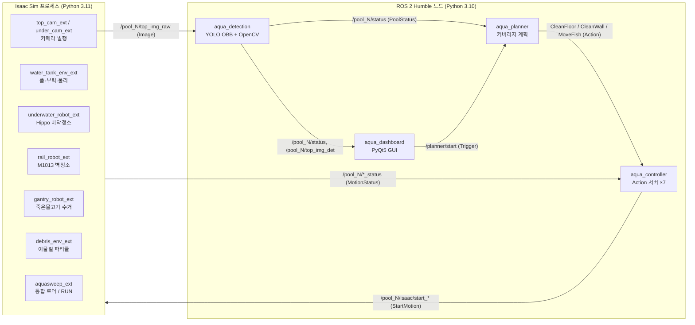
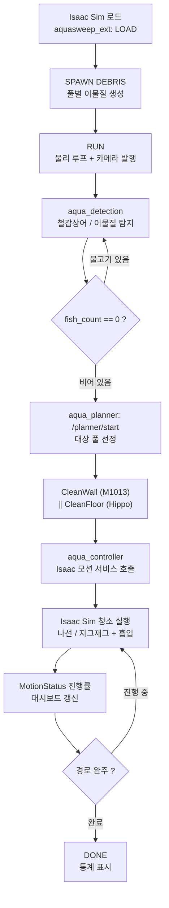

# 🐟 AquaSweep — 양식장 청소 로봇 시뮬레이터

> 사람이 들어가기 어려운 양식장 수조, 로봇이 대신 청소하면 어떨까요?

AquaSweep는 **철갑상어 양식장을 통째로 가상으로 옮겨놓고**, 그 안에서 로봇들이
스스로 바닥·벽을 청소하고 죽은 물고기까지 수거하도록 만든 시뮬레이션이에요.

- 🧽 **Hippo** — 수조 바닥을 누비며 이물질을 빨아들이는 청소 로봇
- 🦾 **벽 청소 코봇** — 수조 둘레 레일을 돌며 벽을 닦는 협동로봇
- 🪝 **갠트리** — 천장에서 내려와 죽은 물고기를 건져 올리는 크레인
- 👁️ **AI 인지** — 카메라로 물고기와 오염을 알아보고, 청소 타이밍을 판단

NVIDIA Isaac Sim으로 물리·물·카메라를 시뮬레이션하고, ROS 2로 7개 수조의
로봇들을 동시에 지휘합니다.

---

## 목차

1. [주요 기능](#1-주요-기능)
2. [시스템 설계 & 플로우 차트](#2-시스템-설계--플로우-차트)
3. [운영체제 / 실행 환경](#3-운영체제--실행-환경)
4. [사용한 장비 목록](#4-사용한-장비-목록)
5. [의존성](#5-의존성)
6. [실행 순서](#6-실행-순서)
7. [디렉터리 구조](#7-디렉터리-구조)

---

## ⚡ 빠른 시작

```bash
git clone https://github.com/yevettee/AquaSweep.git ~/AquaSweep
cd ~/AquaSweep/water_ws && colcon build && source install/setup.bash
ros2 launch aqua_hippo aqua_hippo.launch.py   # Isaac Sim을 켠 뒤 실행
자세한 환경 설정과 Isaac Sim 구동은 실행 순서를 참고하세요.


## 1. 주요 기능

- **양식장 환경 재현** — 40 m × 30 m 건물 안에 직경 8 m 원통형 수조 7개를 배치하고, 풀마다
  철갑상어(5~7마리)와 바닥 이물질 파티클을 생성합니다. (`water_tank_env_ext`, `debris_env_ext`)
- **바닥 청소 로봇 "Hippo"** — BCD(부력 제어) 상태머신(부유 → 침강 → 청소 → 상승)으로 수중에서
  동작하며, 아르키메데스 나선 경로(내부 Pure-Pursuit) 또는 외부 `cmd_vel`로 주행하면서 이물질을
  흡입합니다. 풀당 1대, 총 7대. (`underwater_robot_ext`)
- **벽면 청소 협동로봇** — Doosan **M1013** 6축 코봇을 풀 외벽 원형 레일에 올려, 레일과 팔을 동시에
  움직이는 지그재그 패턴으로 벽을 닦습니다. (`rail_robot_ext`)
- **천장 갠트리 로봇** — X-Y-Z 갠트리가 죽은/의심 개체를 흡착해 수거함으로 옮깁니다.
  (`gantry_robot_ext`, `aquasweep_ext/gantry_builder.py`)
- **비전 인지** — Top-view 카메라 영상에서 **YOLO OBB**로 철갑상어를 탐지하고 OpenCV 블롭으로
  이물질을 검출합니다. 활동성(움직임) 지표로 살아있는/의심 개체를 분류하고 7프레임 median으로
  안정화합니다. (`aqua_detection`)
- **멀티 풀 작업 계획·제어** — 풀 상태(`fish_count == 0`)를 보고 청소 가능한 풀을 골라 벽청소와
  바닥청소를 병렬로 지시하는 Planner → Controller(Action 서버) → Isaac Sim 서비스 구조.
  (`aqua_planner`, `aqua_controller`)
- **대시보드 GUI** — PyQt5 기반으로 풀별 상태, 카메라 영상, 청소 진행률을 보여주고 Start/Pause를
  제어합니다. (`aqua_dashboard`)
- **카메라 발행** — OmniGraph로 풀별 top/under 카메라와 전역(global) top 카메라를 ROS 2
  `sensor_msgs/Image`로 발행. (`top_cam_ext`, `under_cam_ext`)

---

## 2. 시스템 설계 & 플로우 차트

### 2.1 시스템 아키텍처

Isaac Sim 프로세스(Python 3.11)와 ROS 2 노드들(Python 3.10)이 토픽·서비스·액션으로 통신합니다.



### 2.2 청소 동작 플로우



### 2.3 구성 요소

**Isaac Sim 익스텐션** (`isaac_sim_extensions/`)

| 익스텐션 | 역할 |
|---|---|
| `aquasweep_ext` | 통합 로더. LOAD → SPAWN DEBRIS → RUN → PUBLISH CAMS 워크플로우, rclpy executor 구동 |
| `water_tank_env_ext` | 건물·풀 7개 USD 씬 구성, 부력/항력 물리, 철갑상어 스폰·애니메이션 |
| `underwater_robot_ext` | Hippo 바닥청소 로봇, BCD 상태머신, 나선 경로, 흡입 시스템 |
| `rail_robot_ext` | M1013 벽청소 코봇, 원형 레일, 지그재그/클래식 플래너 |
| `gantry_robot_ext` | 천장 갠트리, 죽은 물고기 수거 상태머신 |
| `debris_env_ext` | 풀별 이물질 파티클 스폰 |
| `top_cam_ext` / `under_cam_ext` | OmniGraph 기반 카메라 영상 ROS 2 발행 |
| `common/` | 공유 유틸 (Isaac rclpy 환경 설정, MotionCommandBridge, GantryCommandBridge) |

**ROS 2 패키지** (`water_ws/src/`)

| 패키지 | 노드 / 진입점 | 역할 |
|---|---|---|
| `aqua_interfaces` | (메시지/서비스/액션 정의) | 커스텀 msg·srv·action 단일 출처 |
| `aqua_controller` | `controller_node` ×7 | 풀별 Action 서버, Isaac 모션 서비스 릴레이, `RobotStatus` 발행 |
| `aqua_planner` | `planner_node` | 풀 상태 모니터링, 청소 가능 풀 선정, 벽·바닥 청소 오케스트레이션 |
| `aqua_detection` | `fish_detection_node` | YOLO OBB 물고기 탐지 + OpenCV 이물질, `PoolStatus` 발행 |
| `aqua_dashboard` | `dashboard_node`, `dashboard_gui` | 상태 모니터링 / PyQt5 GUI |
| `aqua_hippo` | (launch 전용) | 전체 bringup 런치 패키지 |

**주요 ROS 2 인터페이스** (`aqua_interfaces`)

- 메시지: `PoolStatus`, `RobotStatus`, `MotionStatus`, `MotionParams`, `PoolPhysicalVariables`
- 서비스: `StartMotion`, `StopMotion`, `PauseMotion`, `ResumeMotion`
- 액션: `CleanFloor`, `CleanWall`, `MoveFish`

---

## 3. 운영체제 / 실행 환경

| 항목 | 버전 |
|---|---|
| OS | Ubuntu 22.04 LTS |
| ROS 2 | Humble Hawksbill |
| 시뮬레이터 | NVIDIA Isaac Sim 5.1 (5.1.0-rc.19) |
| Python (ROS 2 노드) | 3.10 (시스템 / `/opt/ros/humble`) |
| Python (Isaac Sim 내장) | 3.11 |
| GPU | NVIDIA RTX (CUDA) — Isaac Sim 렌더링·PhysX GPU 파티클·YOLO 추론에 필요 |

> ROS 2 노드는 시스템 Python 3.10에서, Isaac Sim 익스텐션은 Isaac 내장 Python 3.11에서 동작합니다.
> 두 런타임이 같은 커스텀 메시지(`aqua_interfaces`)를 쓰도록 [별도 빌드 단계](#6-실행-순서)가 필요합니다.

---

## 4. 사용한 장비 목록

### 4.1 시뮬레이션 내 로봇

| 장비 | 모델 / 에셋 | 사양 · 역할 |
|---|---|---|
| 바닥 청소 로봇 | Hippo (`underwater_robot_ext/data/hippo_v1_lite.usdz`) | 수중 주행 휠 로봇, ~15 kg, 풋프린트 ~0.69 m, BCD 부력 제어, 풀당 1대(총 7대) |
| 벽면 청소 코봇 | Doosan **M1013** (`assets/robot/m1013.usd`) | 6축 협동로봇, 리치 1.3 m, 페이로드 10 kg, 원형 레일(반경 4.07 m, z=1.53 m) 장착 |
| 갠트리 로봇 | 절차적 생성 (USD 빌더) | 천장 X-Y-Z 갠트리(z=7 m), 흡착 패드로 죽은 물고기 수거 |

### 4.2 센서 (카메라)

| 센서 | 토픽 | 해상도 |
|---|---|---|
| 온보드(수중) 카메라 | `/pool_N/under_img_raw` | 1280×720 |
| 풀별 Top-view 카메라 | `/pool_N/top_img_raw` | 640×480 |
| 전역 Top 카메라 | `/global/top_img_raw` | 2560×1920 (7풀 단일 렌더) |

### 4.3 환경 에셋 (`assets/`)

- `scenes/aquafarm_environment.usda`, `aquafarm_final.usdz` — 양식장 건물(40×30 m)
- `scenes/pool_shell.usda` — 원통형 풀 외피(물리 콜라이더 포함)
- `scenes/fish_bin.usdz` — 죽은 물고기 수거함
- `shark/sturgeon_final.usdc` — 철갑상어 메시
- `car/*.usdz` — 야외 주차장 데코 차량 4종

### 4.4 개발/실행 권장 하드웨어

- NVIDIA RTX GPU(VRAM 8 GB 이상 권장) + 최신 NVIDIA 드라이버 / CUDA
- Isaac Sim 권장 사양 충족 데스크톱 (RAM 32 GB 이상 권장)

---

## 5. 의존성

### 5.1 별도 설치 (apt / 공식 설치 프로그램)

- **ROS 2 Humble** — `rclpy`, `std_msgs`, `std_srvs`, `geometry_msgs`, `sensor_msgs`, `nav_msgs`,
  `cv_bridge` (`ros-humble-cv-bridge`). 각 패키지의 `package.xml`에 명시되어 `rosdep`으로 설치 가능.
- **NVIDIA Isaac Sim 5.1** — 공식 설치 프로그램으로 설치 (내장 Python 3.11, rclpy 브리지 포함).

### 5.2 pip 패키지 ([`requirements.txt`](requirements.txt))

```
numpy>=1.24
opencv-python>=4.8
ultralytics>=8.1      # YOLO OBB 추론 (torch / torchvision 포함)
PyQt5>=5.15           # 대시보드 GUI
```

```bash
pip install -r requirements.txt
```

> `cv_bridge`, `rclpy` 및 메시지 패키지는 pip가 아니라 ROS 2 설치본에서 제공됩니다.
> YOLO OBB 가중치 `water_ws/src/aqua_detection/models/yolo_obb_new.pt`는 저장소에 포함되어 있습니다.

### 5.3 워크스페이스 내부 패키지

- `aqua_interfaces` — 본 저장소에서 `colcon`으로 빌드되는 커스텀 메시지/서비스/액션 패키지.
  ROS 2(3.10)와 Isaac Sim(3.11) 양쪽에서 사용하므로 두 번 빌드합니다([6장](#6-실행-순서) 참고).

---

## 6. 실행 순서

> 아래 예시는 저장소를 `~/AquaSweep`에 클론했다고 가정합니다. 클론 위치·디렉터리명은 자유이며,
> 경로만 맞춰 주면 됩니다. (`AquaSweep/`가 저장소 루트 = 이 README가 있는 위치)

### 6.1 ROS 2 워크스페이스 빌드 (Python 3.10)

```bash
git clone https://github.com/yevettee/AquaSweep.git ~/AquaSweep
cd ~/AquaSweep/water_ws
colcon build
source install/setup.bash
```

### 6.2 Isaac Sim용 `aqua_interfaces` 빌드 (Python 3.11)

Isaac Sim 내장 rclpy가 커스텀 메시지를 인식하도록 한 번 실행합니다.
(메시지/액션/서비스 정의를 변경할 때마다 다시 실행)

```bash
cd ~/AquaSweep          # 저장소 루트
./water_ws/scripts/install_aqua_interfaces_for_isaac.sh
# 필요 시 ISAAC_PYTHON, ISAAC_ROS2_BRIDGE 환경변수로 경로 지정
```

### 6.3 Isaac Sim 실행 및 씬 구동

1. Isaac Sim을 실행하고 `aquasweep_ext` 익스텐션을 활성화합니다.
   (Window ▸ Extensions에서 저장소의 `~/AquaSweep/isaac_sim_extensions/` 폴더를 ext 검색 경로로 추가)
2. AquaSweep 패널에서 순서대로 클릭:
   **LOAD**(씬 구성) → **SPAWN DEBRIS**(이물질 생성) → **RUN**(물리·카메라 발행) → **PUBLISH CAMS**

### 6.4 ROS 2 노드 bringup

별도 터미널에서 전체 노드를 한 번에 실행:

```bash
source /opt/ros/humble/setup.bash
source ~/AquaSweep/water_ws/install/setup.bash
ros2 launch aqua_hippo aqua_hippo.launch.py
```

위 런치는 다음을 띄웁니다:

- `all_robots.launch.py` — `controller_node` ×7 (`pool_1`~`pool_7`)
- `fish_detection_node` (`aqua_detection`)
- `planner_node` (`aqua_planner`)
- `dashboard_gui` (`aqua_dashboard`)

### 6.5 청소 시작

- 대시보드 GUI에서 Start, 또는 서비스로 직접 호출:

```bash
# 청소 가능한 모든 풀 시작
ros2 service call /planner/start std_srvs/srv/Trigger "{}"

# 특정 풀만 바닥 청소
ros2 service call /pool_1/start_clean_floor std_srvs/srv/Trigger "{}"
```

### 6.6 디버깅

```bash
ros2 topic echo /pool_1/status              # 풀 상태(PoolStatus)
ros2 topic echo /under_robot_1/cmd_vel      # 로봇 속도 명령
ros2 action list                            # /pool_N/clean_floor 등 확인
ros2 node list
```

> 단일 풀·노드 단위의 세부 통합 테스트 절차는 [`docs/integration_test_guide.md`](docs/integration_test_guide.md),
> 서비스 프로토콜은 [`docs/controller_isaac_architecture.md`](docs/controller_isaac_architecture.md) 참고.

---

## 7. 디렉터리 구조

```
AquaSweep/                            # Git 저장소 루트 (git clone 시 생성)
├── isaac_sim_extensions/             # Isaac Sim 익스텐션 (Python 3.11)
│   ├── aquasweep_ext/                #   통합 로더 (LOAD/RUN 워크플로우)
│   ├── water_tank_env_ext/           #   풀·건물·부력 물리·철갑상어
│   ├── underwater_robot_ext/         #   Hippo 바닥청소 로봇
│   ├── rail_robot_ext/               #   M1013 벽청소 코봇
│   ├── gantry_robot_ext/             #   천장 갠트리 (물고기 수거)
│   ├── debris_env_ext/               #   이물질 파티클
│   ├── top_cam_ext/ , under_cam_ext/ #   카메라 ROS 2 발행
│   └── common/                       #   공유 유틸 (rclpy 환경, 브리지)
│
├── water_ws/
│   ├── src/                          # ROS 2 colcon 패키지 (Python 3.10)
│   │   ├── aqua_interfaces/          #   커스텀 msg / srv / action
│   │   ├── aqua_controller/          #   Action 서버 ×7 + Isaac 서비스 릴레이
│   │   ├── aqua_planner/             #   커버리지 계획·오케스트레이션
│   │   ├── aqua_detection/           #   YOLO OBB + OpenCV 인지
│   │   ├── aqua_dashboard/           #   PyQt5 대시보드
│   │   └── aqua_hippo/               #   전체 bringup 런치
│   └── scripts/
│       └── install_aqua_interfaces_for_isaac.sh
│
├── assets/                           # USD 에셋 (로봇·풀·물고기·차량)
├── docs/                             # 아키텍처·통합 테스트·트러블슈팅 문서
├── requirements.txt                  # pip 의존성
└── README.md
```
