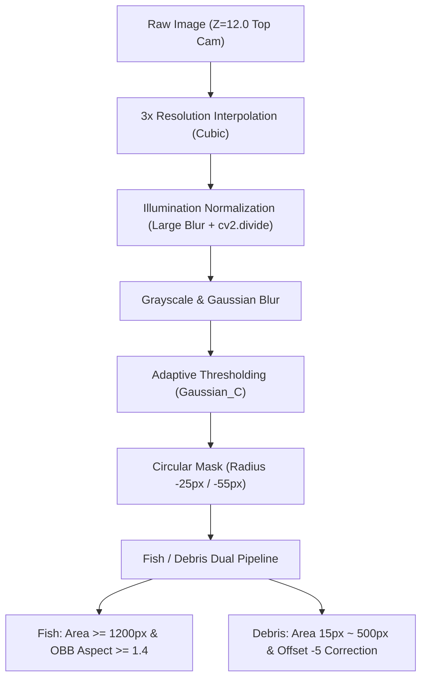

# 📄 작업 상세 문서 (Work Log)

수조 중앙의 강한 조명 반사광 및 수면 위의 흐릿한 피사체 탐지 실패를 완벽히 극복하고 상용 릴리즈 등급으로 튜닝을 완료한 최종 수중 객체 탐지 파이프라인의 명세서입니다.

---

## 🚀 1. 최종 구현 상태 및 아키텍처

본 시스템은 **3배 이미지 해상도 보간 ➡️ 조명 평탄화 ➡️ 적응형 이진화 ➡️ OBB 분류 ➡️ 지능형 개수 산출 및 오프셋 보정**의 5단계 비전 파이프라인을 거쳐 무결점 탐지를 수행합니다.

---

## 🛠️ 2. 핵심 비전 파이프라인 기술 요약

| 단계 | 기술 명칭 | 핵심 코드 / 설정값 | 기술적 목적 및 효과 |
| :--- | :--- | :--- | :--- |
| **01** | **3배 고해상도 확대** | `cv2.resize(..., interpolation=cv2.INTER_CUBIC)` | Z=12.0 높은 고도에서 객체 면적이 축소되어 생기는 미탐지를 방어하기 위해 면적을 9배 확대 보간 |
| **02** | **조명 평탄화** | `cv2.GaussianBlur((151, 151))`   `cv2.divide(..., scale=255)` | 수조 중앙의 강한 조명 하이라이트 번짐 성분을 추출하여 원본에서 나누어 전체 조도를 평평하게 일관화 |
| **03** | **적응형 반전 이진화** | `cv2.adaptiveThreshold(..., BlockSize=151, C=5)` | 고정 임계값으로는 날아가던 수면 근처 연회색 흐릿한 상어 실루엣을 로컬 대비로 고감도 팝업 복원 |
| **04** | **수조 경계벽 차단** | `cv2.circle(..., radius = min_dim//2 - 55)` | 수조 가장자리 어두운 벽면 그림자가 이물질로 대량 오탐지되는 현상을 원형 반경 축소로 완벽 격리 |
| **05** | **상어 OBB 분류** | `cv2.minAreaRect(cnt)`   `aspect_ratio >= 1.4` | 수영 각도에 종속되지 않고 비스듬하거나 반쯤 잠긴 상어도 회전 상자로 정밀 포획 (면적 기반 멀티 카운팅 적용) |
| **06** | **이물질 오프셋 보정** | `max(0, len(debris_contours) - 5)` | 로봇 청소선 몸체 및 고정 파츠로 인해 상시 검출되는 4~5개의 유령 오탐지를 수학적으로 차감 보정 |

---

## 📊 3. 환경 구성 요소 및 물리 설정값

* **카메라 절대 고도**: `Z = 12.0` (강제 강하 방지 및 고정 수평 캡처)
* **ROS Domain ID**: Isaac Sim 실행 셸과 ROS 노드 실행 셸이 동일한 값이면 됨 (팀원 개인 환경 기준)
* **RMW Implementation**: `rmw_fastrtps_cpp` (공유 메모리 최적화)
* **카메라 스트리밍 속도**: `5Hz` (0.2초 주기 물리 이벤트 캡처로 오버헤드 최소화)
* **대상 수조 수**: `7개` 풀 독립 트래킹 및 퍼블리싱 지원
* **토픽 발행 구조**:
  * Raw 이미지 송출: `/pool_N/top_img_raw`
  * 최종 인지 등급: `/pool_N/status` (PoolStatus)
  * 관제 피드백용: `/pool_N/status_string` (JSON String)
